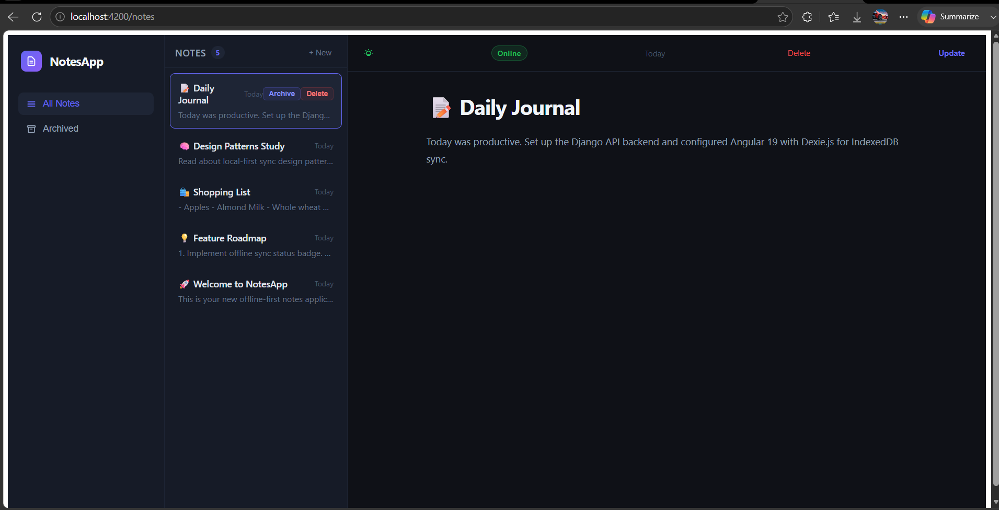
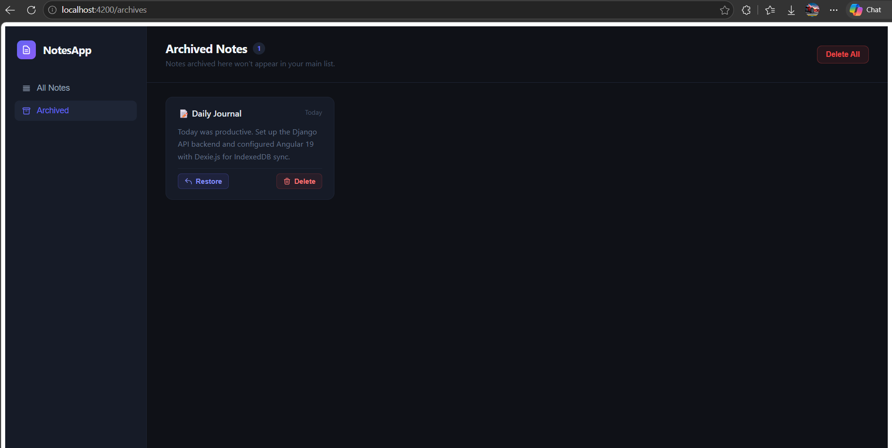
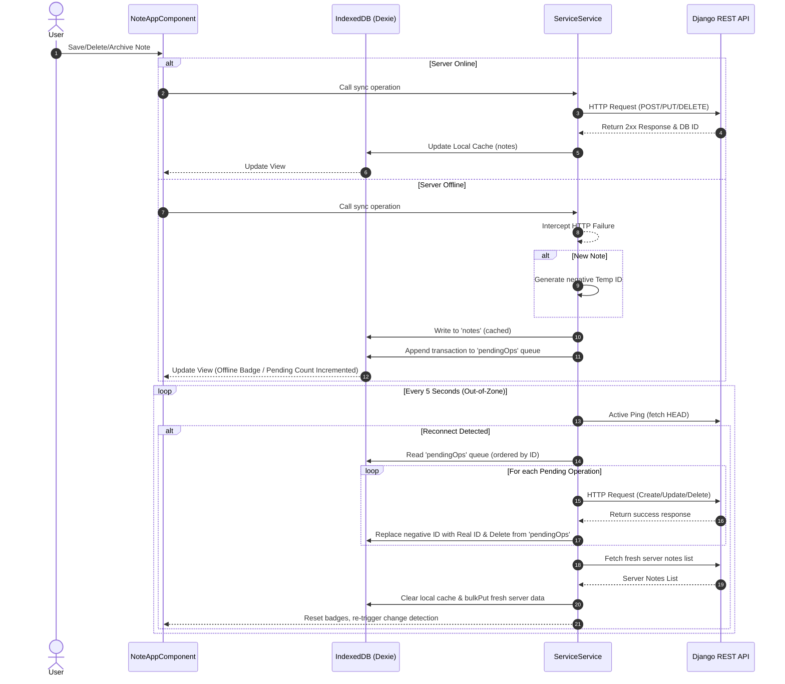

# 📝 Offline-First Notes Application

A modern, robust, and responsive note-taking application designed with an **offline-first architecture**. Built with a **Django REST Framework (DRF)** backend and an **Angular 19** frontend using **Dexie.js** (IndexedDB) for local client-side persistence and active out-of-zone connectivity synchronization.

### 📸 Application Screenshots

#### Main Notes Dashboard


#### Archived Notes View


---

## ✨ Key Features

- **Offline-First Synchronization**: Write, edit, or delete notes anytime. All changes are saved locally in the browser immediately and synchronized with the backend automatically once connectivity is restored.
- **Local Persistence with Dexie.js**: Seamless wrapper around browser IndexedDB to persist notes and a queue of pending operations (`pendingOps`) across sessions.
- **Out-of-Zone Connectivity Polling**: Uses an active connection checker that pings the server every 5 seconds. To prevent CPU overhead and unnecessary Angular change detection cycles, the poller runs outside Angular’s standard `NgZone`.
- **Deduplication Sync Queue**: Intelligently handles redundant offline operations (e.g. updating an offline-created note multiple times compiles into a single create operation, and deleting an offline-created note cancels its sync action).
- **Dedicated Archiving App**: Move notes out of the main notes list into a separate, lightweight archiving system with full restoration (unarchive) and bulk/single permanent deletion capabilities.

---

## 🛠️ Tech Stack

### Frontend
* **Framework**: Angular 19
* **State & Local Storage**: Dexie.js (IndexedDB wrapper)
* **Async Library**: RxJS
* **HTTP Client**: Angular HttpClient

### Backend
* **Framework**: Django 6.0.5
* **API Toolkit**: Django REST Framework (DRF) 3.17.1
* **CORS Management**: django-cors-headers
* **Database**: SQLite

---

## 📐 Architecture & Sync Flow

The application relies on a dual-state sync flow. Notes created offline are assigned temporary negative IDs. Upon reconnecting, these notes are posted to the backend, and their negative IDs are replaced with permanent server-generated IDs.

### Sync Flow Diagram



---

## 🚀 Setup & Installation

### 1. Prerequisites
* Python 3.10+
* Node.js v18+ and npm

---

### 2. Backend Setup (Django)

1. **Navigate to the backend directory**:
   ```bash
   cd noteApp
   ```

2. **Create and Activate a Virtual Environment**:
   * On Windows:
     ```bash
     python -m venv notesEnv
     ..\notesEnv\Scripts\activate
     ```
   * On macOS/Linux:
     ```bash
     python3 -m venv notesEnv
     source ../notesEnv/bin/activate
     ```

3. **Install Dependencies**:
   ```bash
   pip install -r requirements.txt
   ```

4. **Run Database Migrations**:
   ```bash
   python manage.py migrate
   ```

5. **Start the Development Server**:
   ```bash
   python manage.py runserver
   ```
   The backend server runs at `http://127.0.0.1:8000/`.

---

### 3. Frontend Setup (Angular)

1. **Navigate to the frontend directory**:
   ```bash
   cd z_frontend/noteUI
   ```

2. **Install Node Packages**:
   ```bash
   npm install
   ```

3. **Start the Angular Development Server**:
   ```bash
   npm start
   ```
   The frontend application will compile and start running at `http://localhost:4200/`.

---

## 🔌 API Reference

All backend endpoints are prefixed with `/api`.

### Notes API (`notes` app)

| Method | Endpoint | Description |
| :--- | :--- | :--- |
| **GET** | `/api/notes/` | Retrieves all non-archived notes. |
| **POST** | `/api/notes/` | Creates a new note. |
| **GET** | `/api/notes/<id>/` | Retrieves details of a specific note. |
| **PUT** | `/api/notes/<id>/` | Overwrites a specific note. |
| **PATCH** | `/api/notes/<id>/` | Partially updates a specific note. |
| **DELETE** | `/api/notes/<id>/` | Deletes a note permanently. |

### Archive API (`archive` app)

| Method | Endpoint | Description |
| :--- | :--- | :--- |
| **GET** | `/api/archive/` | List all archived notes. |
| **POST** | `/api/archive/<note_id>/` | Archive a note by ID. |
| **DELETE** | `/api/archive/<note_id>/unarchive/` | Unarchive (restore) a note. |
| **DELETE** | `/api/archive/<note_id>/delete/` | Permanently delete an archived note. |
| **DELETE** | `/api/archive/delete-all/` | Permanently delete all archived notes. |

---

## ⚡ Offline-First Sync & Conflict Design

To ensure optimal performance and flawless conflict resolution, the synchronization layer uses several robust design decisions:

1. **Out-of-Zone Active Checking**: Traditional browser `navigator.onLine` checks are notoriously unreliable (e.g., connected to a router with no internet access). The Angular component runs an active fetch request to the server every 5 seconds. This runs outside of Angular's zone to prevent draining device performance from constant change-detection triggers.
2. **Negative ID Scoping**: Frontend-generated records are assigned negative IDs starting at `-1`. This allows immediate distinction between server-created records (positive IDs) and offline-created records.
3. **Queue Deduplication**: If an offline note is updated multiple times, instead of queueing multiple `update` operations, the service rewrites the existing queue entry. If an offline note is deleted before syncing, the service deletes it from the queue, resulting in zero unnecessary API calls.
